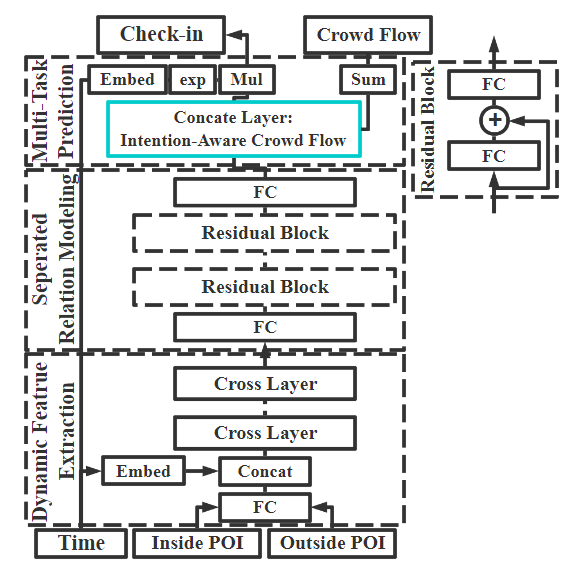

# DeepFlowGen
A Py-Torch based implementation for DeepFlowGen, a deep neural network which generates intention-aware crowd flow by PoI (Point of Interest) distribution. The detailed implementation of DeepFlowGen is introduced in paper [*DeepFlowGen: Intention-aware Fine Grained Crowd Flow Generation via Deep Neural Networks*](https://ieeexplore.ieee.org/document/9416248).

In addition to regular crowd inflow/outflow in regions, which is of shape $R \times T$ ($R$ represents the number of regions while $T$ is the number of time slots), intention-aware crowd flow, which is of shape $R \times T \times I$, have an additional dimension to represent the intention of crowd flow. Concretely, we partition the crowd flow in a certain region & time slot, which is a scalar, into $I$ values, according to the PoI visiting/leaving population. 

Our proposed DeepFlowGen is expected to generate intention-aware crowd flow merely based on static PoI distribution. This model requires the total crowd flow and users' check-in distribution for supervision in the training stage.

#### The Architecture of DeepFlowGen

- Dynamic Feature Extraction Stage
- Relation Modeling Stage
- Multi-task Generation Stage

#### The Output of DeepFlowGen - A Case Study in Beijing

##### Xidan (A Famous Commercial District)

##### Beihang University

##### Summer Palace (Tourist Attraction)

